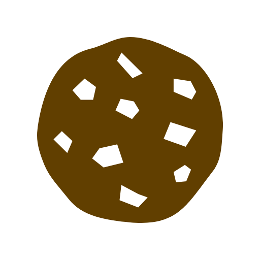

# CookieBin
A service to store cookies publicly for anyone to use


## Architecture

- **Frontend** — static files in `public/`, deployed to Firebase Hosting
- **Backend** — serverless functions in `api/`, deployed to Vercel
- **Database** — Supabase table `cookie_dumps` (`id`, `site`, `content`, `views`, `created_at`) plus RPC `cookie_dump_hit` for atomic view counting
- **API protection** — reCAPTCHA v2 Invisible; `POST /api/dumps` verifies the token server-side via Google siteverify

## API

- `GET /api/dumps` — 50 most recent dumps (metadata only)
- `POST /api/dumps` — create a dump: `{ "site", "content", "token" }` where `token` is a reCAPTCHA v2 invisible token
- `GET /api/dumps/:id` — fetch a full dump, increments its view counter

## Environment variables (Vercel)

- `SUPABASE_URL`
- `SUPABASE_SERVICE_ROLE_KEY`
- `RECAPTCHA_SECRET_KEY`

## Deploy

```bash
firebase deploy --only hosting:cookiebin   # frontend
vercel deploy --prod                       # backend
```
